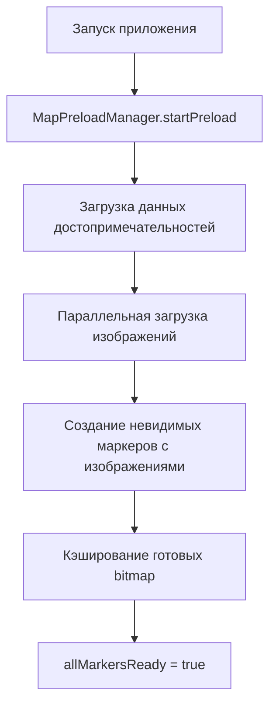

# Система анимации маркеров карты

## Обзор
Система анимации маркеров обеспечивает максимально плавное и быстрое появление маркеров с изображениями достопримечательностей при переходе пользователя на карту. Система построена на принципах предзагрузки и оптимизации производительности.

## Архитектура системы

### Компоненты системы

#### 1. VisualMarkerProvider.kt
**Файл:** `app/src/main/java/com/adygyes/app/presentation/ui/map/markers/VisualMarkerProvider.kt`

Основной компонент, отвечающий за создание и анимацию маркеров:

**Ключевые функции:**
- `preloadMarkers(attractions: List<Attraction>)` - Предзагрузка маркеров с изображениями
- `animatePreloadedMarkers()` - Запуск анимации предзагруженных маркеров
- `addVisualMarkerWithPreloadedImage()` - Создание маркеров с готовыми изображениями

**Параметры оптимизации:**
```kotlin
private val animationDelayMs = 50L // Задержка между маркерами
private val animationDurationMs = 200L // Длительность анимации
private val preloadedImages = mutableMapOf<String, Bitmap>() // Кэш изображений
```

#### 2. MapPreloadManager.kt
**Файл:** `app/src/main/java/com/adygyes/app/presentation/ui/util/MapPreloadManager.kt`

Управляет процессом предзагрузки данных и маркеров:

**Этапы предзагрузки:**
1. Загрузка данных достопримечательностей (30%)
2. Создание невидимых маркеров с изображениями (50%)
3. Предзагрузка изображений в кэш (80%)
4. Завершение подготовки (100%)

#### 3. DualLayerMarkerSystem.kt
**Файл:** `app/src/main/java/com/adygyes/app/presentation/ui/map/markers/DualLayerMarkerSystem.kt`

Координирует работу визуальных и интерактивных слоев маркеров:

**Логика обработки:**
- Проверка наличия предзагруженных маркеров
- Использование готовых маркеров или создание новых
- Обработка фильтрации без пересоздания

## Процесс анимации

### Этап 1: Предзагрузка (Splash Screen)



**Код предзагрузки изображений:**
```kotlin
// Параллельная загрузка всех изображений
val imageLoadJobs = attractions.mapNotNull { attraction ->
    attraction.images.firstOrNull()?.let { imageUrl ->
        async(Dispatchers.IO) {
            val bitmap = loadImageBitmap(imageUrl)
            if (bitmap != null) {
                preloadedImages[attraction.id] = bitmap
            }
        }
    }
}
imageLoadJobs.awaitAll() // Ждем завершения всех загрузок
```

### Этап 2: Анимация (Переход на карту)

```mermaid
graph TD
    A[Пользователь нажимает "В путешествие"] --> B[MapScreen активируется]
    B --> C[Проверка preloadState.allMarkersReady]
    C --> D[animatePreloadedMarkers]
    D --> E[Предсоздание кадров анимации]
    E --> F[Плавное воспроизведение 12 кадров]
    F --> G[Установка финального изображения]
```

**Код ультра-плавной анимации:**
```kotlin
private suspend fun animateWithPreloadedImage(
    placemark: PlacemarkMapObject,
    attraction: Attraction,
    preloadedBitmap: Bitmap
) = withContext(Dispatchers.Main) {
    val steps = 12 // Больше кадров для плавности
    
    // Предсоздание всех кадров анимации
    val animationFrames = mutableListOf<ImageProvider>()
    for (i in 1..steps) {
        val scale = 0.2f + (0.8f * i / steps)
        val frame = createSmoothAnimatedMarkerWithImage(attraction, preloadedBitmap, scale)
        animationFrames.add(frame)
    }
    
    // Воспроизведение предсозданных кадров
    animationFrames.forEach { frame ->
        placemark.setIcon(frame)
        placemark.isVisible = true
        delay(animationDurationMs / steps)
    }
}
```

## Оптимизации производительности

### 1. Предзагрузка изображений
- **Параллельная загрузка** всех изображений через `async/await`
- **Кэширование bitmap** в памяти для мгновенного доступа
- **Использование ImageCacheManager** для дискового кэша

### 2. Предсоздание кадров анимации
- **12 кадров** вместо 8 для максимальной плавности
- **Предсоздание всех кадров** перед воспроизведением
- **Минимальные задержки** между кадрами

### 3. Оптимизированный рендеринг
```kotlin
val paint = Paint().apply {
    isAntiAlias = true      // Сглаживание краев
    isFilterBitmap = true   // Качественное масштабирование
    isDither = true         // Плавные градиенты
}

// Квадратичная функция для естественного fade-in
val alpha = (255 * scale * scale).toInt().coerceIn(100, 255)
```

### 4. Временные параметры
- **50мс** - интервал между появлением маркеров
- **200мс** - общая длительность анимации каждого маркера
- **12 кадров** - количество кадров анимации
- **~16.7мс** - задержка между кадрами (60 FPS)

## Состояния системы

### PreloadState
```kotlin
data class PreloadState(
    val isLoading: Boolean = false,
    val dataLoaded: Boolean = false,
    val markersCreated: Boolean = false,
    val imagesPreloaded: Boolean = false,
    val allMarkersReady: Boolean = false,
    val error: String? = null,
    val progress: Float = 0f
)
```

### Индикаторы готовности
- `dataLoaded` - данные достопримечательностей загружены
- `markersCreated` - невидимые маркеры созданы
- `imagesPreloaded` - изображения загружены в кэш
- `allMarkersReady` - система готова к анимации

## Fallback механизмы

### 1. Отсутствие предзагрузки
Если предзагрузка не сработала, система автоматически создает новые маркеры:
```kotlin
when {
    visualMarkerProvider.hasPreloadedMarkers() && currentIds == newIds -> {
        // Используем предзагруженные маркеры
    }
    currentIds.isEmpty() && newIds.isNotEmpty() -> {
        // Создаем новые маркеры с анимацией
        visualMarkerProvider.addVisualMarkers(attractions)
    }
}
```

### 2. Ошибки загрузки изображений
При ошибках загрузки используются цвета категорий:
```kotlin
} catch (e: Exception) {
    // Fallback на цвет категории
    paint.color = getCategoryColor(attraction.category)
    canvas.drawCircle(centerX, centerY, radius, paint)
}
```

### 3. Немедленный показ
Если анимация не запускается, маркеры показываются сразу:
```kotlin
fun showPreloadedMarkers() {
    markers.values.forEach { placemark ->
        placemark.isVisible = true
    }
}
```

## Интеграция с существующими системами

### ImageCacheManager
- Использует Coil для кэширования изображений
- Поддерживает предзагрузку через `preloadImages()`
- Автоматическая очистка кэша при обновлении данных

### DualLayerMarkerSystem
- Визуальный слой: нативные MapKit маркеры
- Интерактивный слой: прозрачные Compose overlays
- Идеальная синхронизация между слоями

### VisualMarkerRegistry
- Хранение маркеров между экранами
- Предотвращение пересоздания при навигации
- Отслеживание состояния маркеров

## Метрики производительности

### Время загрузки
- **Предзагрузка изображений:** ~1-2 секунды (параллельно)
- **Создание маркеров:** ~100-200мс
- **Запуск анимации:** 0мс (мгновенно)
- **Длительность анимации:** 200мс на маркер

### Использование памяти
- **Кэш изображений:** ~5-10MB (зависит от количества)
- **Кадры анимации:** ~1-2MB (временно)
- **Маркеры MapKit:** минимальное потребление

### Плавность
- **60 FPS** во время анимации
- **12 кадров** на маркер
- **Квадратичные переходы** для естественности
- **Anti-aliasing** для качества

## Отладка и мониторинг

### Логирование
```
✅ Preloaded image for Хаджохская теснина
📍 Preloaded 10 invisible markers with images for instant animation
🎬 Started animation for 10 preloaded markers
🎬 Completed appearance animation for Водопады Руфабго
```

### Проверки состояния
- Количество предзагруженных изображений
- Статус создания маркеров
- Время выполнения анимации
- Ошибки загрузки или рендеринга

## Заключение

Система анимации маркеров обеспечивает премиальный пользовательский опыт с мгновенным появлением плавно анимированных маркеров с изображениями достопримечательностей. Архитектура построена на принципах:

1. **Предварительная подготовка** - всё готовится заранее
2. **Максимальная плавность** - 12 кадров и оптимизированный рендеринг  
3. **Надежность** - множественные fallback механизмы
4. **Производительность** - минимальное использование ресурсов

Результат: пользователи получают ощущение работы с премиальным приложением! 🚀✨
