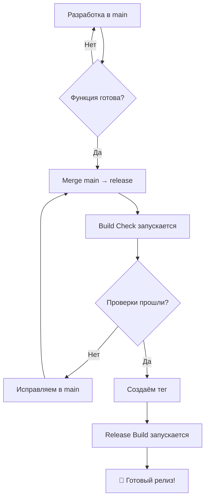

# 🌿 Стратегия веток для AdygGIS

## 📋 Обзор стратегии

Оптимизированная стратегия веток для эффективной разработки и релизов:

```
main (разработка) → release (проверки) → теги (релизы)
```

## 🔄 Workflow процессы

### 🚀 **main** - Основная ветка разработки
- **Назначение:** Активная разработка, эксперименты, новые функции
- **Действия:** Свободные коммиты без ограничений
- **CI/CD:** Никаких автоматических проверок
- **Философия:** "Быстро итерируем, не тормозим разработку"

### 🔍 **release** - Ветка подготовки к релизу  
- **Назначение:** Финальная проверка перед релизом
- **Действия:** Merge из main когда функции готовы
- **CI/CD:** Полные проверки (Build Check workflow)
- **Философия:** "Убеждаемся что всё работает перед релизом"

### 🏷️ **Теги** - Финальные релизы
- **Назначение:** Стабильные версии для пользователей
- **Действия:** Создание тегов с release ветки
- **CI/CD:** Автоматическая сборка APK/AAB (Release workflow)
- **Философия:** "Готовые к публикации версии"

---

## 🛠️ Практические сценарии

### Сценарий 1: Разработка новой функции

```bash
# 1. Работаете в main (никаких проверок)
git checkout main
git add .
git commit -m "Add new search feature"
git push origin main  # ← Никаких workflow не запускается

# 2. Продолжаете разработку
git commit -m "Fix search bug"
git push origin main  # ← Снова никаких проверок

# 3. Функция готова? Переносим в release
git checkout release
git merge main
git push origin release  # ← Запускается Build Check 🔍
```

### Сценарий 2: Подготовка релиза

```bash
# 1. Все функции готовы в main
git checkout main
git commit -m "Final touches for v1.0.1"

# 2. Переносим в release для проверки
git checkout release
git merge main
git push origin release  # ← Build Check проверяет всё

# 3. Если проверки прошли - создаём релиз
git tag v1.0.1
git push origin v1.0.1  # ← Release Build создаёт APK/AAB 🚀
```

### Сценарий 3: Hotfix критической ошибки

```bash
# 1. Быстрый фикс в main
git checkout main
git commit -m "🔥 Fix critical crash"
git push origin main

# 2. Срочно в release
git checkout release  
git merge main
git push origin release  # ← Проверяем что фикс работает

# 3. Срочный релиз
git tag v1.0.2
git push origin v1.0.2  # ← Автоматическая сборка
```

---

## ⚙️ Настройки CI/CD

### 🔍 Build Check Workflow
```yaml
# Запускается только для release ветки
on:
  push:
    branches: [ release ]
  pull_request:
    branches: [ release ]
```

**Что проверяет:**
- ✅ Код компилируется без ошибок
- ✅ Lint проверки проходят
- ✅ Unit тесты работают
- ✅ Debug APK собирается

### 🚀 Release Build Workflow  
```yaml
# Запускается только при создании тегов
on:
  push:
    tags: [ 'v*.*.*' ]
```

**Что делает:**
- 🔐 Расшифровывает keystore
- 📦 Собирает production APK
- 📱 Собирает AAB для Google Play
- 🎉 Создаёт GitHub Release
- 📎 Прикрепляет файлы

---

## 🎯 Преимущества новой стратегии

### ✅ Для разработки:
- **Быстрые итерации** - никаких задержек на проверки
- **Свобода экспериментов** - можно пушить незавершённый код
- **Нет блокировок** - CI не мешает творческому процессу
- **Фокус на коде** - не отвлекаемся на проверки

### ✅ Для качества:
- **Проверки перед релизом** - всё тестируется в release
- **Стабильные релизы** - только проверенный код попадает в теги
- **Контролируемый процесс** - осознанный переход main → release → tag
- **Откат при проблемах** - можно не мержить в release если что-то сломано

### ✅ Для производительности:
- **Экономия ресурсов** - CI запускается только когда нужно
- **Быстрая разработка** - нет ожидания проверок при каждом коммите
- **Целевые проверки** - тестируем только кандидатов на релиз

---

## 📋 Чек-лист использования

### При разработке:
- [ ] Работаю в `main` ветке
- [ ] Коммичу и пушу свободно
- [ ] Не жду никаких проверок
- [ ] Фокусируюсь на функциональности

### При подготовке релиза:
- [ ] Мержу `main` в `release`
- [ ] Жду завершения Build Check
- [ ] Проверяю что все тесты прошли
- [ ] Исправляю проблемы если есть

### При создании релиза:
- [ ] Обновляю версию в `build.gradle.kts`
- [ ] Создаю тег с `release` ветки
- [ ] Жду создания GitHub Release
- [ ] Скачиваю AAB для Google Play

---

## 🔄 Диаграмма процесса



---

## 💡 Советы по использованию

### 🚀 Для быстрой разработки:
```bash
# Алиас для быстрых коммитов в main
git config alias.quick '!git add . && git commit -m "WIP: quick changes" && git push origin main'

# Использование:
git quick  # Быстрый коммит без проверок
```

### 🔍 Для подготовки релиза:
```bash
# Алиас для подготовки релиза
git config alias.prepare-release '!git checkout release && git merge main && git push origin release'

# Использование:
git prepare-release  # Автоматически мержит и запускает проверки
```

### 🏷️ Для создания релиза:
```bash
# Функция для создания релиза
function New-Release {
    param($version)
    git tag "v$version"
    git push origin "v$version"
    Write-Host "Release v$version created! Check GitHub Actions." -ForegroundColor Green
}

# Использование:
New-Release "1.0.1"  # Создаёт релиз v1.0.1
```

**🎉 Теперь у вас оптимальная стратегия: быстрая разработка + надёжные релизы!**
