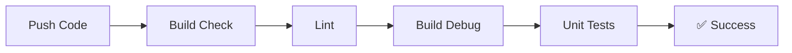
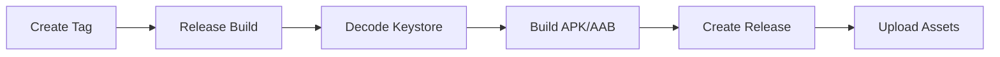

# 🔧 Настройка GitHub для релизов AdygGIS

## 📋 Обзор

Этот документ описывает настройку GitHub репозитория для автоматической сборки и релизов AdygGIS.

## 🏗️ Архитектура CI/CD

### Workflows:
1. **🔍 Build Check** (`build-check.yml`) - Проверка сборки на каждый push/PR
2. **🚀 Release Build** (`release.yml`) - Автоматическая сборка релизов

### Стратегия веток:
- `main` - стабильная ветка для релизов
- `develop` - ветка разработки (опционально)
- `feature/*` - ветки фич

## 🔐 Настройка GitHub Secrets

### Обязательные секреты:

#### 1. Keystore секреты:
```bash
# Конвертируйте keystore в base64:
base64 -i keystore/adygyes-release.keystore

# Или в PowerShell:
[Convert]::ToBase64String([IO.File]::ReadAllBytes("keystore/adygyes-release.keystore"))
```

**GitHub Secrets для добавления:**
- `KEYSTORE_BASE64` - base64 encoded keystore файл
- `KEYSTORE_PASSWORD` - пароль keystore (из keystore.properties)
- `KEY_PASSWORD` - пароль ключа (из keystore.properties)  
- `KEY_ALIAS` - алиас ключа (из keystore.properties)

#### 2. API ключи:
- `YANDEX_MAPKIT_API_KEY` - ваш Yandex MapKit API ключ

### Как добавить секреты:

1. Откройте ваш GitHub репозиторий
2. Перейдите в **Settings** → **Secrets and variables** → **Actions**
3. Нажмите **New repository secret**
4. Добавьте каждый секрет по очереди

## 🚀 Создание релиза

### Автоматический релиз (рекомендуется):

1. **Обновите версию в коде:**
   ```kotlin
   // app/build.gradle.kts
   versionCode = 2  // Увеличьте на 1
   versionName = "1.0.1"  // Semantic versioning
   ```

2. **Создайте и запушьте тег:**
   ```bash
   git add .
   git commit -m "🎉 Release v1.0.1"
   git tag v1.0.1
   git push origin main
   git push origin v1.0.1
   ```

3. **GitHub Actions автоматически:**
   - Соберет APK и AAB
   - Создаст GitHub Release
   - Приложит файлы к релизу
   - Сгенерирует release notes

### Ручной релиз:

1. Перейдите в **Actions** → **Release Build**
2. Нажмите **Run workflow**
3. Введите версию (например, `1.0.1`)
4. Нажмите **Run workflow**

## 📱 Файлы релиза

После успешной сборки получите:
- `app-full-release.apk` - для тестирования
- `app-full-release.aab` - для Google Play Store

## 🔄 Workflow процесс

### При push в main/develop:


### При создании тега:


## 🛠️ Локальная разработка

### Ветки для разных целей:

```bash
# Основная разработка
git checkout develop
git checkout -b feature/new-feature

# Hotfix для продакшена
git checkout main  
git checkout -b hotfix/critical-bug

# Релизная ветка (опционально)
git checkout develop
git checkout -b release/v1.1.0
```

### Semantic Versioning:

- `v1.0.0` - Major release (breaking changes)
- `v1.1.0` - Minor release (new features)
- `v1.0.1` - Patch release (bug fixes)

## 🔍 Мониторинг сборок

### Проверка статуса:
1. Перейдите в **Actions** в вашем репозитории
2. Посмотрите статус последних workflow
3. При ошибках - кликните на failed job для деталей

### Типичные проблемы:

#### ❌ "Keystore not found"
**Решение:** Проверьте `KEYSTORE_BASE64` secret

#### ❌ "Invalid keystore password"  
**Решение:** Проверьте `KEYSTORE_PASSWORD` и `KEY_PASSWORD`

#### ❌ "API key missing"
**Решение:** Добавьте `YANDEX_MAPKIT_API_KEY` secret

## 📊 Badges для README

Добавьте в README.md:

```markdown


```

## 🎯 Следующие шаги

1. **Настройте secrets** (15 минут)
2. **Создайте первый тег** для тестирования
3. **Проверьте сборку** в Actions
4. **Скачайте AAB** для Google Play

---

## 💡 Советы

### Безопасность:
- ✅ Keystore файлы в .gitignore
- ✅ Secrets только в GitHub Actions
- ✅ Никогда не коммитьте пароли

### Производительность:
- ✅ Gradle cache включен
- ✅ Parallel builds
- ✅ Incremental compilation

### Качество:
- ✅ Lint checks на каждый PR
- ✅ Unit tests в CI
- ✅ Automatic release notes

**🎉 Готово! Теперь у вас профессиональный CI/CD pipeline!**
